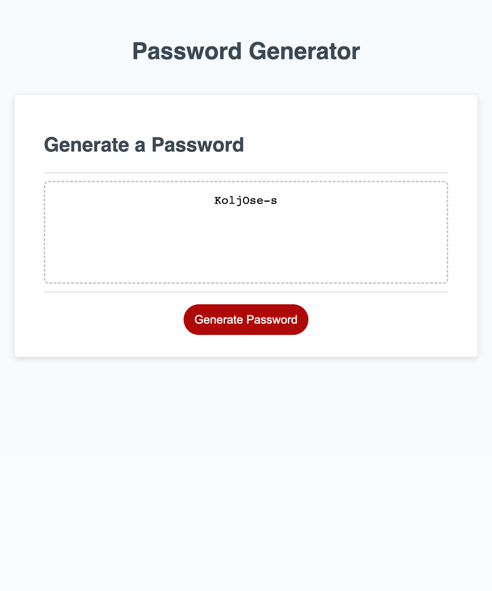

# Brandon-PW-Generator
Creating a working password generated by writing JavaScript that allows for action to occur within the given starter code.

## Description
This project is a password generator. Using the provided starter code. JavaScript is incorporated to provide the user with an easy tool that created randomly generated passwords. The user first enters the length of password desired. The next step the user takes is answering perameter questions regarding their desires. These questions are whether to include numbers, special characters, uppercase letters, and lowercase letters to their randomly generated password. After answering the prompted questions a password is generated within the text box.
Link to the project:

# Getting Started

## Dependencies

In order to access this web page a working device that has access to the internet and a proper web browser is necessary.

## Installing

If the items listed above are available, there are no additional installations needed to access this project.

## Help

If the project/ web page is not running properly, please contact me through the ways listed below.

# Authors

Brandon Ruano
bruano@uw.edu
github.com/bruano95